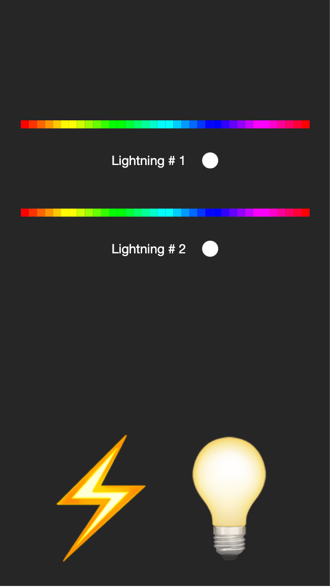

# LedStorm 

This repository contains all the instructions and code needed to be able to create your own 🌩 led strom 🌩 You can use it for decoration purposes, as a lamp or as inspiration for any other project :smiley: Depending on your DIY skills the result would look like this:


This project will also let you control the lamp from your browser using an app like this:



You can select the colors of the two lightnings and decide to show two of them using 3 different patterns or turn them on forever by tapping on the ⚡️ or 💡 buttons.

**Keep in mind this project is customizable, but you'll need to modify the hardware usage and also to tune the software to be able to use more than 2 fifty-leds-long stripes (which is the default configuration). If you do it, please share the result with us!** 

## Hardware instructions

To be able to get your own led storm you'll need to buy some hardware:

* [Raspberry Pi Zero](https://www.amazon.es/Raspberry-Pi-Zero-Kit-inicio/dp/B072LWBL37/ref=sr_1_5?__mk_es_ES=%C3%85M%C3%85%C5%BD%C3%95%C3%91&dchild=1&keywords=raspberry+pi+zero&qid=1627318147&sr=8-5)
* [Micro SD card](https://www.amazon.es/ARCANITE-Tarjeta-microSDXC-adaptador-AKV30A164/dp/B07RW7RSVQ/ref=sr_1_1_sspa?__mk_es_ES=%C3%85M%C3%85%C5%BD%C3%95%C3%91&dchild=1&keywords=micro+sd+card&qid=1627318348&sr=8-1-spons&psc=1&spLa=ZW5jcnlwdGVkUXVhbGlmaWVyPUEyUEVTQ0RQSzBYQzBHJmVuY3J5cHRlZElkPUEwMjA5MDIzVDE3SVhFQTRZS0Q2JmVuY3J5cHRlZEFkSWQ9QTA2ODIzNTczUjRDRUZFVDhZMldSJndpZGdldE5hbWU9c3BfYXRmJmFjdGlvbj1jbGlja1JlZGlyZWN0JmRvTm90TG9nQ2xpY2s9dHJ1ZQ==)
* [Wires](https://www.amazon.es/AZDelivery-Jumper-Arduino-Raspberry-Breadboard/dp/B07VFK8L9F/ref=sr_1_21?__mk_es_ES=%C3%85M%C3%85%C5%BD%C3%95%C3%91&dchild=1&keywords=raspberry+pi+jumper&qid=1627318379&sr=8-21)
* [1m long 5v led stripes x 2](https://www.amazon.es/gp/product/B088B9LK1M/ref=ppx_yo_dt_b_asin_title_o09_s00?ie=UTF8&psc=1)
* [Ultrasounds Sensor](https://www.amazon.es/M%C3%B3dulo-medici%C3%B3n-distancia-ultras%C3%B3nico-precisi%C3%B3n/dp/B088PCXB5M/ref=asc_df_B088PCXB5M/?tag=googshopes-21&linkCode=df0&hvadid=469181688672&hvpos=&hvnetw=g&hvrand=18132390602775342885&hvpone=&hvptwo=&hvqmt=&hvdev=c&hvdvcmdl=&hvlocint=&hvlocphy=1005419&hvtargid=pla-971971076325&psc=1) This one is optional, you don't need to buy it if you don't want to use it.
* Cotton.
* Cardboard.
* Glue.

Once you buy everything, it is time to connect all the wires. You'll need to connect the led stripes to the following Raspberry PI pins:

* Led strip 1 VCC pin to the +5V Raspberry PI pin.
* Led strip 1 GND pin to any GND Raspberry PI pin.
* Led strip 1 control pin to GPIO 18 Raspberry PI pin.
* Led strip 2 VCC pin to the +5V Raspberry PI pin.
* Led strip 2 GND pin to any GND Raspberry PI pin.
* Led strip 2 control pin to GPIO 19 Raspberry PI pin.
* Proximity sensor VCC pin to the +5V Raspberry PI pin.
* Proximity sensor GND pin to any GND Raspberry PI pin.
* Proximity sensor ECHO pin to GPIO 8 Raspberry PI pin.
* Proximity sensor TRIGGER pin to GPIO 10 Raspberry PI pin.


**You can change the pins if you want, but keep in mind the hardware has some restrictions related to what pins you can use and you will also need to change the code to use the pins you want.**

Once you get all the wires in place, you'll need to install Raspberry Pi OS into your RaspberryPi. You can use [RaspberryPi Imager](https://www.raspberrypi.org/software/) or any other similar too. You'll need internet connection, so install the OS image and configure it to be installed to your local area network.

Ensure you've disconected the audio input in your raspberry pi by commenting the line ``#dtparam=audio=on`` in the ``/boot/config.txt`` file.

Once you are done you'll need to clone this repository and place it into any folder:

```
cd Desktop
git clone https://github.com/pedrovgs/LedStorm.git
```

Once you've cloned the repository you will need to install some python dependencies. You can use this command:

```
sudo pipenv install
```

If everything is installed properly you should be able to run this command and start LedStorm server:

```
sudo pipenv run python led_storm_server.py
```

As soon as you get the server running you'll see how the app to control the storm also works from [http://raspberrypi.local](http://raspberrypi.local).

Last but not least, you'll need to configure your Raspberry Pi to start the app whenever the device is rebooted. To do this you'll have to modify the content of the ``/etc/rc.local`` file to execute this command before the line ``exit 0``:

```
cd <LOCATION WHERE YOU CLONED THE REPOSITORY> ;  sudo pipenv run python led_storm_server.py ; sudo pipenv run python led_storm.py
```

This part of the script ``sudo pipenv run python led_storm.py`` will start a different program checking if there is somethign close to the proximity sensors in order to show a lightning. **Remove this part of the script if you don't want to use this feature**. 

This will start LedStorm when the Raspberry Pi is turned on and it will led you control your strom from this link: [http://raspberrypi.local](http://raspberrypi.local)

## Software instructions

### Backend

This respository contains two main projects. In the root folder you'll find some python code starting a [Flask](https://flask.palletsprojects.com/en/2.0.x/) server. This HTTP server will serve the web page you can use to control the strom and also will be used as a classic REST API in case you want to create your own client.

To be able to modify this code you'll need to install Python 3.7 and pipenv. From the run folder you can run ``pipenv install`` in order to install all the dependencies we need. Keep in midn Raspberry Pi dependencies may not be available depending on the OS version you are using. Here you have some useful commands for our server:

Keep in midn all the commands related to the led stripes will need to be run as super users:

```
sudo pipenv run led_storm_server.py # Start server
sudo pipenv run led_storm.py # Start proximity sensor code
sudo pipenv run led_strip_tester.py # Turns your led on and off. Can be used to check if the hardwrae is ok.
pipenv run py.test -v # Run tests
pipenv run pylint *.py # Run linter
pipenv run pylint *.py
pipenv run autopep8 --in-place --aggressive --aggressive *.py # Automatically formats code
```

### Frontend

Inside the app folder you'll find a web app built using [Swift UI](https://developer.apple.com/xcode/swiftui/) and [WebAssembly](https://developer.mozilla.org/es/docs/WebAssembly). To be precise we used [Tokamak](https://github.com/TokamakUI/Tokamak), a SwiftUI-compatible framework for building browser apps with WebAssembly and native apps for other platforms. Here you have some useful commands for our web client you can run from the app folder:

```
brew bundle # Install some dependencies needed
brew install swiftwasm/tap/carton # Installs the main build tool we will use
carton dev # Starts the development server and lets you see your changes using hot reloading.
carton bundle # Generates a bundle you can deploy from any HTTP server.
```

Remember you'll have to update server-side bundle if you change the client-side code. This process is not automated right now, so you'll have to do it manually.

All the code is configured to use GitHub actions as the main CI tool. You can review the details in the ``.github/workflows`` folder. 

🌩🌩🌩 I hope you like this project, have fun with your brand new storm. Remember, imagination, some leds, and a RaspberryPi will take you wherever you want 🌩🌩🌩

Developed By
------------

* Pedro Vicente Gómez Sánchez - <pedrovicente.gomez@gmail.com>

<a href="https://twitter.com/pedro_g_s">
  
</a>
<a href="https://es.linkedin.com/in/pedrovgs">
  
</a>

License
-------

Copyright 2021 Pedro Vicente Gómez Sánchez

GNU GENERAL PUBLIC LICENSE Version 3, 29 June 2007